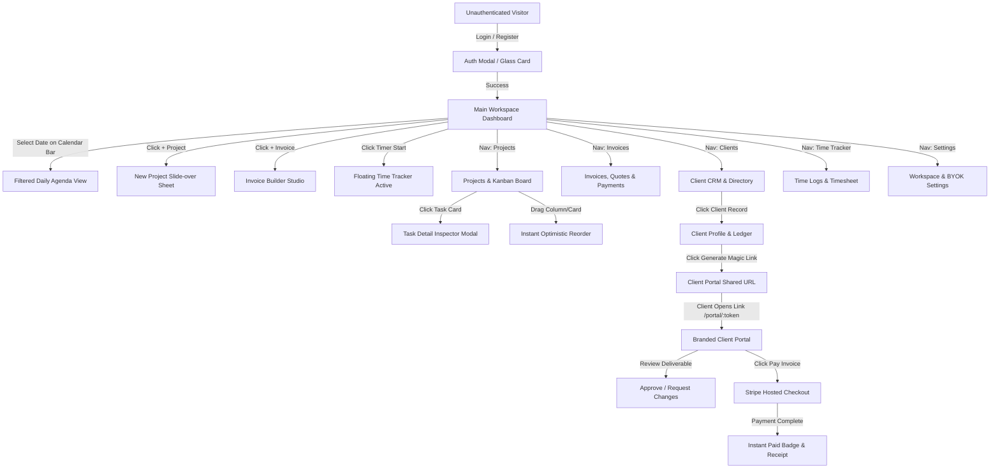
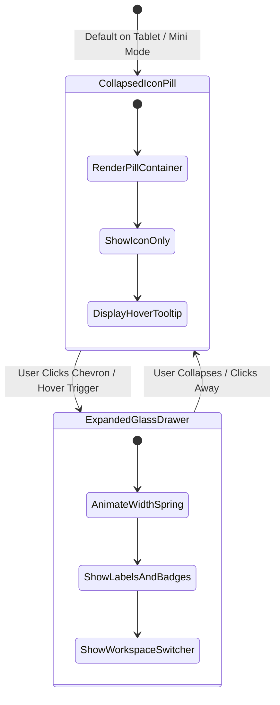

# 📱 App Flow & UX State Machine Specification

> **Project Name:** RuneyOS - Open Source Project & Business Management OS  
> **Aesthetic Foundation:** Apple Liquid Glass (Blur `backdrop-blur-2xl`, Shimmer Borders, Floating Docks)  
> **Purpose:** Explicitly maps out every screen, transition, loading state, error state, and empty state to guarantee zero frontend hallucinations during AI code generation.

---

## 🗺️ 1. Complete Screen Flow & Navigation State Machine



---

## 💊 2. Floating Pill Sidebar State Machine

The navigation sidebar is a floating glass container situated on the left edge with two distinct responsive states:



* **Collapsed State (Icon Pill)**:
  - Width: `72px` | Border Radius: `9999px` (Rounded Pill) | Floating margin: `16px`.
  - Displays icons only (Lucide SVG with subtle glow on active).
  - Hovering an icon triggers an Apple-style floating tooltip bubble (`bg-zinc-800/90 text-xs px-2.5 py-1 rounded-lg border border-white/10`).
* **Expanded State (Glass Drawer)**:
  - Width: `240px` | Border Radius: `24px` | Spring animation: `stiffness: 300, damping: 30`.
  - Displays Workspace selector, navigation item labels, unread counters, and quick "+ Create" action button.

---

## 📅 3. Liquid Glass Calendar Bar State Machine

Situated at the top of the main dashboard viewport, providing daily context and quick agenda filtering:

```
┌────────────────────────────────────────────────────────────────────────────────────────┐
│                                 LIQUID GLASS CALENDAR BAR                              │
├────────────────────────────────────────────────────────────────────────────────────────┤
│  [ < ]   Mon 15   Tue 16   Wed 17  │ [ Thu 18 TODAY ] │  Fri 19   Sat 20   Sun 21  [ > ]  │
│          • task            •• due  │   ⚡ 3 tasks      │           • invoice            │
└────────────────────────────────────────────────────────────────────────────────────────┘
```

* **Behavior & Transitions**:
  - **Horizontal Inertia Scroll**: Smooth trackpad/mouse swipe horizontally through past and future days.
  - **Today Auto-Center**: One-click "Today" button centers the active date in the glass viewport.
  - **Glowing Active Selection**: The currently selected date transforms into an Apple-style frosted pill with an indigo/cyan gradient border (`ring-1 ring-cyan-400/40 bg-white/10 shadow-[0_0_15px_rgba(6,182,212,0.25)]`).
  - **Deadline Micro-Dots**: Small colored indicator pips (Purple = Task Due, Emerald = Invoice Due, Amber = Meeting).

---

## 🎨 4. Complete Screen State Matrix

| View / Screen | ⏳ Loading State | 📭 Empty State | ✅ Success State | ⚠️ Error State |
| :--- | :--- | :--- | :--- | :--- |
| **Main Dashboard** | Shimmer skeleton cards & frosted glass placeholder grid. | "Welcome to RuneyOS. Create your first project or client to get started." | Full analytics overview, active tasks, unbilled hours, and revenue graph. | "Failed to load workspace data. [Retry]" red glowing toast. |
| **Kanban Board** | 4 column skeletons with pulsing card bars. | "No tasks in this board yet. Click + to add your first card." | Multi-column drag-and-drop board with smooth spring transitions. | Reverts optimistic card drop with shake animation + error banner. |
| **Time Tracker Pill** | Pulsing dot in floating dock pill. | Timer reset to `00:00:00` with "Select Project & Task" prompt. | Live digital counter ticking with glowing green recording badge. | "Failed to sync timer to cloud. Saved locally." amber badge. |
| **Invoices & Quotes** | Table row skeleton with shimmer bars. | "No invoices generated yet. Create a professional invoice in 60s." | Searchable, filterable list with status pills (`Draft`, `Sent`, `Paid`). | "Could not generate PDF. Please verify your invoice items." |
| **Client CRM** | Grid of glass client card skeletons. | "Your client list is empty. Add your first client to start billing." | Cards showing client logo, active project count, and total billed revenue. | Inline validation errors for missing email or invalid phone format. |
| **Client Portal** | Glass spinner with agency logo watermark. | "No active deliverables or pending tasks currently assigned to you." | Sleek public project overview, deliverable download links, and Stripe payment. | "This portal link has expired or is invalid. Contact your agency." |
| **AI Settings (BYOK)** | Shimmer input fields. | Pre-filled default key masks with "Phase 2 / Coming Soon" badge. | "API Key verified and stored securely in AES-256 vault." | "Invalid API key format. Please check your provider key." |

---

## ✨ 5. Micro-Interactions & Apple Spring Physics

```typescript
// Standard Apple Spring Configurations for Framer Motion
export const appleSpringTransitions = {
  // Pill Sidebar Expansion
  pillExpand: {
    type: "spring",
    stiffness: 350,
    damping: 28,
    mass: 0.8
  },
  // Kanban Drag & Drop Snapping
  cardSnap: {
    type: "spring",
    stiffness: 400,
    damping: 32
  },
  // Modal & Slide-over Glass Panel Entry
  modalGlass: {
    type: "spring",
    stiffness: 280,
    damping: 24,
    opacity: { duration: 0.2 }
  }
};
```
