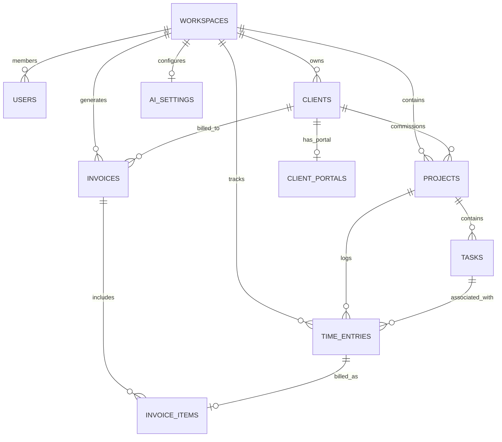

# 🗄️ Database Schema & Entity Relationship Model (ERD)

> **Project Name:** RuneyOS - Open Source Project & Business Management OS  
> **Database Engine:** PostgreSQL 16+ (Production / Cloud) & SQLite (Local Development) via Prisma ORM  
> **Integrity Guarantee:** Full ACID compliance, cascading deletes, foreign keys, and unique indexes for financial and client records.

---

## 📊 1. Entity Relationship Diagram (ERD)



---

## 📝 2. Complete SQL DDL Schema Definition

```sql
-- 1. Workspaces Table
CREATE TABLE workspaces (
    id TEXT PRIMARY KEY,
    name TEXT NOT NULL,
    slug TEXT UNIQUE NOT NULL,
    owner_id TEXT NOT NULL,
    currency VARCHAR(3) DEFAULT 'USD',
    logo_url TEXT,
    brand_color VARCHAR(10) DEFAULT '#6366f1',
    stripe_account_id TEXT,
    created_at TIMESTAMP WITH TIME ZONE DEFAULT CURRENT_TIMESTAMP,
    updated_at TIMESTAMP WITH TIME ZONE DEFAULT CURRENT_TIMESTAMP
);
CREATE INDEX idx_workspaces_owner ON workspaces(owner_id);

-- 2. Users Table
CREATE TABLE users (
    id TEXT PRIMARY KEY,
    email TEXT UNIQUE NOT NULL,
    name TEXT NOT NULL,
    password_hash TEXT,
    avatar_url TEXT,
    role VARCHAR(20) DEFAULT 'owner' CHECK(role IN ('owner', 'admin', 'member', 'contractor')),
    workspace_id TEXT REFERENCES workspaces(id) ON DELETE CASCADE,
    created_at TIMESTAMP WITH TIME ZONE DEFAULT CURRENT_TIMESTAMP,
    updated_at TIMESTAMP WITH TIME ZONE DEFAULT CURRENT_TIMESTAMP
);
CREATE INDEX idx_users_workspace ON users(workspace_id);

-- 3. Clients (CRM) Table
CREATE TABLE clients (
    id TEXT PRIMARY KEY,
    workspace_id TEXT NOT NULL REFERENCES workspaces(id) ON DELETE CASCADE,
    name TEXT NOT NULL,
    email TEXT NOT NULL,
    phone TEXT,
    company_name TEXT,
    billing_address TEXT,
    default_hourly_rate DECIMAL(10, 2) DEFAULT 0.00,
    currency VARCHAR(3) DEFAULT 'USD',
    notes TEXT,
    created_at TIMESTAMP WITH TIME ZONE DEFAULT CURRENT_TIMESTAMP,
    updated_at TIMESTAMP WITH TIME ZONE DEFAULT CURRENT_TIMESTAMP
);
CREATE INDEX idx_clients_workspace ON clients(workspace_id);

-- 4. Projects Table
CREATE TABLE projects (
    id TEXT PRIMARY KEY,
    workspace_id TEXT NOT NULL REFERENCES workspaces(id) ON DELETE CASCADE,
    client_id TEXT REFERENCES clients(id) ON DELETE SET NULL,
    title TEXT NOT NULL,
    description TEXT,
    status VARCHAR(20) DEFAULT 'active' CHECK(status IN ('planning', 'active', 'in_review', 'completed', 'archived')),
    budget DECIMAL(12, 2) DEFAULT 0.00,
    deadline TIMESTAMP WITH TIME ZONE,
    accent_color VARCHAR(10) DEFAULT '#3b82f6',
    created_at TIMESTAMP WITH TIME ZONE DEFAULT CURRENT_TIMESTAMP,
    updated_at TIMESTAMP WITH TIME ZONE DEFAULT CURRENT_TIMESTAMP
);
CREATE INDEX idx_projects_workspace ON projects(workspace_id);
CREATE INDEX idx_projects_client ON projects(client_id);

-- 5. Tasks Table (Kanban)
CREATE TABLE tasks (
    id TEXT PRIMARY KEY,
    project_id TEXT NOT NULL REFERENCES projects(id) ON DELETE CASCADE,
    title TEXT NOT NULL,
    description TEXT,
    column_status VARCHAR(20) DEFAULT 'backlog' CHECK(column_status IN ('backlog', 'in_progress', 'in_review', 'done')),
    priority VARCHAR(10) DEFAULT 'medium' CHECK(priority IN ('low', 'medium', 'high', 'urgent')),
    order_index INT NOT NULL DEFAULT 0,
    due_date TIMESTAMP WITH TIME ZONE,
    estimated_minutes INT DEFAULT 0,
    created_at TIMESTAMP WITH TIME ZONE DEFAULT CURRENT_TIMESTAMP,
    updated_at TIMESTAMP WITH TIME ZONE DEFAULT CURRENT_TIMESTAMP
);
CREATE INDEX idx_tasks_project ON tasks(project_id);
CREATE INDEX idx_tasks_order ON tasks(project_id, column_status, order_index);

-- 6. Time Entries Table (Floating Ambient Timer)
CREATE TABLE time_entries (
    id TEXT PRIMARY KEY,
    workspace_id TEXT NOT NULL REFERENCES workspaces(id) ON DELETE CASCADE,
    user_id TEXT NOT NULL REFERENCES users(id) ON DELETE CASCADE,
    project_id TEXT REFERENCES projects(id) ON DELETE SET NULL,
    client_id TEXT REFERENCES clients(id) ON DELETE SET NULL,
    task_id TEXT REFERENCES tasks(id) ON DELETE SET NULL,
    description TEXT NOT NULL,
    start_time TIMESTAMP WITH TIME ZONE NOT NULL,
    end_time TIMESTAMP WITH TIME ZONE,
    duration_seconds INT NOT NULL DEFAULT 0,
    hourly_rate DECIMAL(10, 2) NOT NULL DEFAULT 0.00,
    is_billable BOOLEAN DEFAULT TRUE,
    is_billed BOOLEAN DEFAULT FALSE,
    invoice_item_id TEXT,
    created_at TIMESTAMP WITH TIME ZONE DEFAULT CURRENT_TIMESTAMP
);
CREATE INDEX idx_time_workspace ON time_entries(workspace_id);
CREATE INDEX idx_time_unbilled ON time_entries(workspace_id, is_billable, is_billed);

-- 7. Invoices Table
CREATE TABLE invoices (
    id TEXT PRIMARY KEY,
    workspace_id TEXT NOT NULL REFERENCES workspaces(id) ON DELETE CASCADE,
    client_id TEXT NOT NULL REFERENCES clients(id) ON DELETE RESTRICT,
    invoice_number VARCHAR(50) NOT NULL,
    status VARCHAR(20) DEFAULT 'draft' CHECK(status IN ('draft', 'sent', 'viewed', 'paid', 'overdue', 'cancelled')),
    issue_date DATE NOT NULL,
    due_date DATE NOT NULL,
    currency VARCHAR(3) DEFAULT 'USD',
    subtotal DECIMAL(12, 2) NOT NULL DEFAULT 0.00,
    tax_rate DECIMAL(5, 2) DEFAULT 0.00,
    tax_amount DECIMAL(12, 2) DEFAULT 0.00,
    total_amount DECIMAL(12, 2) NOT NULL DEFAULT 0.00,
    notes TEXT,
    stripe_checkout_id TEXT,
    stripe_payment_url TEXT,
    paid_at TIMESTAMP WITH TIME ZONE,
    created_at TIMESTAMP WITH TIME ZONE DEFAULT CURRENT_TIMESTAMP,
    updated_at TIMESTAMP WITH TIME ZONE DEFAULT CURRENT_TIMESTAMP
);
CREATE UNIQUE INDEX uq_invoice_workspace_number ON invoices(workspace_id, invoice_number);

-- 8. Invoice Items Table
CREATE TABLE invoice_items (
    id TEXT PRIMARY KEY,
    invoice_id TEXT NOT NULL REFERENCES invoices(id) ON DELETE CASCADE,
    time_entry_id TEXT REFERENCES time_entries(id) ON DELETE SET NULL,
    description TEXT NOT NULL,
    quantity DECIMAL(10, 2) NOT NULL DEFAULT 1.00,
    unit_price DECIMAL(10, 2) NOT NULL DEFAULT 0.00,
    amount DECIMAL(12, 2) NOT NULL DEFAULT 0.00,
    created_at TIMESTAMP WITH TIME ZONE DEFAULT CURRENT_TIMESTAMP
);
CREATE INDEX idx_invoice_items ON invoice_items(invoice_id);

-- 9. Zero-Friction Client Portals Table
CREATE TABLE client_portals (
    id TEXT PRIMARY KEY,
    workspace_id TEXT NOT NULL REFERENCES workspaces(id) ON DELETE CASCADE,
    client_id TEXT UNIQUE NOT NULL REFERENCES clients(id) ON DELETE CASCADE,
    token TEXT UNIQUE NOT NULL, -- High-entropy crypto string (e.g. nanoid 32 chars)
    is_password_protected BOOLEAN DEFAULT FALSE,
    password_hash TEXT,
    expires_at TIMESTAMP WITH TIME ZONE,
    is_enabled BOOLEAN DEFAULT TRUE,
    created_at TIMESTAMP WITH TIME ZONE DEFAULT CURRENT_TIMESTAMP,
    updated_at TIMESTAMP WITH TIME ZONE DEFAULT CURRENT_TIMESTAMP
);
CREATE UNIQUE INDEX idx_client_portals_token ON client_portals(token);

-- 10. Bring-Your-Own-Key (BYOK) AI Settings (Phase 2 Ready)
CREATE TABLE ai_settings (
    id TEXT PRIMARY KEY,
    workspace_id TEXT UNIQUE NOT NULL REFERENCES workspaces(id) ON DELETE CASCADE,
    provider VARCHAR(20) DEFAULT 'openai' CHECK(provider IN ('openai', 'anthropic', 'gemini', 'groq')),
    encrypted_api_key TEXT,
    is_enabled BOOLEAN DEFAULT FALSE,
    updated_at TIMESTAMP WITH TIME ZONE DEFAULT CURRENT_TIMESTAMP
);
```
